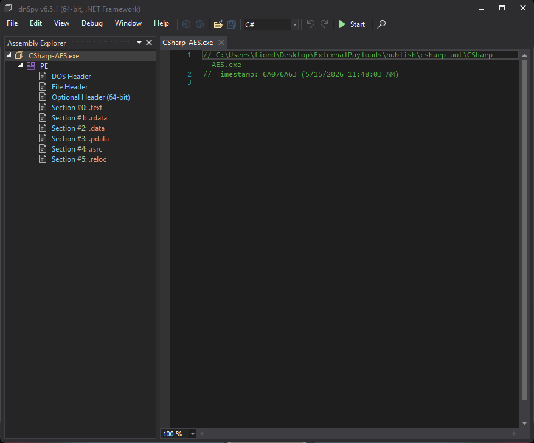
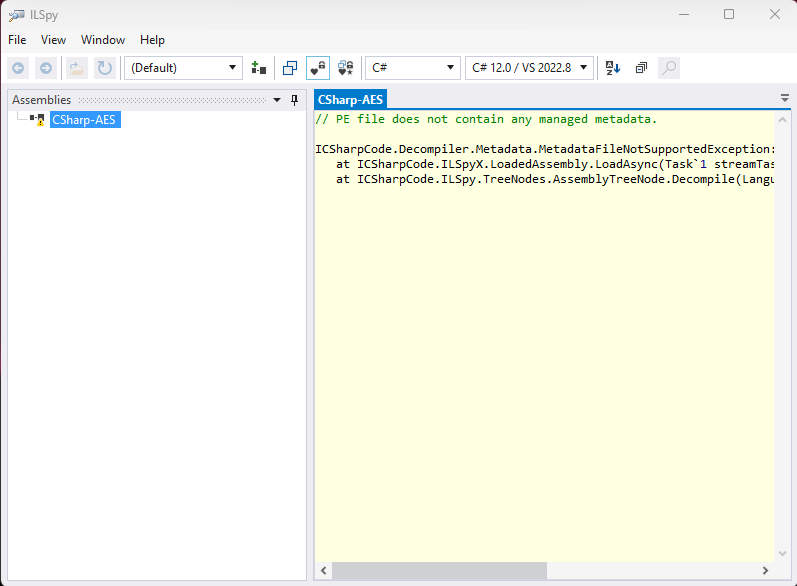

## .NET の実行方法とデコンパイル

.NET アプリケーションは、IL (Intermediate Language) でコンパイルされ、実行時に JIT (Just-In-Time) コンパイラによってネイティブコードに変換されます。このため、.NET アプリケーションは比較的簡単にデコンパイルされることがあります。

### dnSpy でデコンパイルをしてみる

dnSpy は .NET アプリケーションをデコンパイルするためのツールです。下記のプログラムを dnSpy でデコンパイルしてみます。

```cs
using System.Runtime.CompilerServices;
using System.Security.Cryptography;
using System.Text;

internal static class Program
{
    private static readonly byte[] KeyA =
    [
        0x2B, 0x7E, 0x15, 0x16, 0x28, 0xAE, 0xD2, 0xA6,
        0xAB, 0xF7, 0x15, 0x88, 0x09, 0xCF, 0x4F, 0x3C,
        0x76, 0x2E, 0x71, 0x60, 0xF3, 0x8B, 0x4D, 0xA5,
        0x6A, 0x78, 0x4D, 0x90, 0x45, 0x19, 0x0C, 0xFE
    ];

    private static readonly byte[] Iv =
    [
        0x00, 0x01, 0x02, 0x03, 0x04, 0x05, 0x06, 0x07,
        0x08, 0x09, 0x0A, 0x0B, 0x0C, 0x0D, 0x0E, 0x0F
    ];

    static void Main(string[] args)
    {
        byte[] key = KeyA;

        string input = args.Length > 0
            ? string.Join(" ", args)
            : Console.ReadLine() ?? string.Empty;

        byte[] plaintext = Encoding.UTF8.GetBytes(input);

        using Aes aes = Aes.Create();
        aes.Key = key;
        aes.IV = Iv;
        aes.Mode = CipherMode.CBC;
        aes.Padding = PaddingMode.PKCS7;

        using ICryptoTransform encryptor = aes.CreateEncryptor();
        byte[] ciphertext = encryptor.TransformFinalBlock(plaintext, 0, plaintext.Length);

        Console.WriteLine(Convert.ToBase64String(ciphertext));
    }
}
```

基本的には stdin で受け取った文字列を AES で暗号化して、Base64 エンコードして出力するプログラムです。

実行例:
```
.\csharp-jit\CSharp-AES.exe
test
1KX6l80eQEpH7A+bCUqb5Q==
```

この `CSharp-AES.exe` を dnSpy で開いてみると、下記のコードを得られます。
```cs
using System;
using System.Runtime.CompilerServices;
using System.Security.Cryptography;
using System.Text;

// Token: 0x02000006 RID: 6
[NullableContext(1)]
[Nullable(0)]
internal static class Program
{
	// Token: 0x06000006 RID: 6 RVA: 0x000020A0 File Offset: 0x000002A0
	private static void Main(string[] args)
	{
		byte[] key = Program.KeyA;
		string input = ((args.Length != 0) ? string.Join(" ", args) : (Console.ReadLine() ?? string.Empty));
		byte[] plaintext = Encoding.UTF8.GetBytes(input);
		using (Aes aes = Aes.Create())
		{
			aes.Key = key;
			aes.IV = Program.Iv;
			aes.Mode = CipherMode.CBC;
			aes.Padding = PaddingMode.PKCS7;
			using (ICryptoTransform encryptor = aes.CreateEncryptor())
			{
				Console.WriteLine(Convert.ToBase64String(encryptor.TransformFinalBlock(plaintext, 0, plaintext.Length)));
			}
		}
	}

	// Token: 0x04000004 RID: 4
	private static readonly byte[] KeyA = new byte[]
	{
		43, 126, 21, 22, 40, 174, 210, 166, 171, 247,
		21, 136, 9, 207, 79, 60, 118, 46, 113, 96,
		243, 139, 77, 165, 106, 120, 77, 144, 69, 25,
		12, 254
	};

	// Token: 0x04000005 RID: 5
	private static readonly byte[] Iv = new byte[]
	{
		0, 1, 2, 3, 4, 5, 6, 7, 8, 9,
		10, 11, 12, 13, 14, 15
	};
}
```

Visual Basic で書かれたコードも同様にデコンパイルできます。

```vb
Imports System
Imports System.Security.Cryptography
Imports System.Text

Module Program
    ' AES-256 fixed key (32 bytes)
    Private ReadOnly Key As Byte() = {
        &H2B, &H7E, &H15, &H16, &H28, &HAE, &HD2, &HA6,
        &HAB, &HF7, &H15, &H88, &H09, &HCF, &H4F, &H3C,
        &H76, &H2E, &H71, &H60, &HF3, &H8B, &H4D, &HA5,
        &H6A, &H78, &H4D, &H90, &H45, &H19, &H0C, &HFE
    }

    ' AES fixed IV (16 bytes)
    Private ReadOnly IV As Byte() = {
        &H00, &H01, &H02, &H03, &H04, &H05, &H06, &H07,
        &H08, &H09, &H0A, &H0B, &H0C, &H0D, &H0E, &H0F
    }

    Sub Main(args As String())
        Dim input As String
        If args.Length > 0 Then
            input = String.Join(" ", args)
        Else
            input = If(Console.ReadLine(), String.Empty)
        End If

        Dim plaintext As Byte() = Encoding.UTF8.GetBytes(input)

        Using aes As Aes = Aes.Create()
            aes.Key = Key
            aes.IV = IV
            aes.Mode = CipherMode.CBC
            aes.Padding = PaddingMode.PKCS7

            Using encryptor As ICryptoTransform = aes.CreateEncryptor()
                Dim ciphertext As Byte() = encryptor.TransformFinalBlock(plaintext, 0, plaintext.Length)
                Console.WriteLine(Convert.ToBase64String(ciphertext))
            End Using
        End Using
    End Sub
End Module
```

### JIT(Just-In-Time) コンパイルと AOT(Ahead-Of-Time) コンパイル、R2R(ReadyToRun)

上記は JIT(Just-In-Time) コンパイルされたコードで、IL(Intermediate Language) に実行前コンパイルしておくものです。実行時は IL からネイティブコードに変換しつつ実行するため、比較的簡単にデコンパイルされてしまいます。

一方で、AOT(Ahead-Of-Time) コンパイルは、実行前に IL をネイティブコードに変換しておく方法です。これにより、実行時の JIT コンパイルが不要になり、起動時間の短縮やデコンパイルの難易度向上が期待できます。
一見 AOT の方がメリットが多いように見えますが、コンパイル時間が長いこと、プラットフォームごとに異なるネイティブコードを生成する必要があることなどのデメリットも存在します。

R2R(ReadyToRun) は、AOT と JIT の中間的なアプローチで、IL をネイティブコードに変換しておくものの、必要に応じて JIT コンパイルも行う方法です。これにより、起動時間の短縮とデコンパイルの難易度向上を両立させることができます。

### AOT コンパイルされたバイナリを見る
では、AOT コンパイルされたバイナリを見てみましょう。下記のコマンドで AOT コンパイルされたバイナリを生成します。
```bash
dotnet publish -c Release -r win-x64 --self-contained true /p:PublishReadyToRun=true
```

生成されたコードは IL ではなくネイティブコードになっています。このため、dnSpy や ILSpy などの .NET でコンパイラでは解析が出来ません。





## R2R Stomping

.NET のコンパイルにおいて、DLL ファイルが生成されることがあります。JIT コンパイルされたコードでは、こちらを参照することで IL コードのデコンパイルが可能です。
R2R DLL では下記の 2種類のコードを同時に持っています。

```
CSharp-AES.dll
├── [マネージドセクション]
│   ├── メタデータ  ← 型・フィールド・メソッドの定義
│   └── IL（中間言語）← dnSpy/ILSpy が読むコード
└── [R2R ネイティブセクション]
    ├── ReadyToRunHeader
    ├── 各メソッドのネイティブコード ← CPU が直接実行するコード
    └── Fixup セル（外部参照の解決テーブル）
```

ただ、デフォルトではネイティブセクションのコードを優先して実行し、JIT フォールバック時にマネージドセクションのコードが実行されます。
このため、IL 側とネイティブコードを別の物にすることで、IL のデコンパイルで得られるコードと実際に実行されるプログラムを別物にすることが出来ます。これが R2R Stomping です。

### 試しに作ってみる

下記に記載される内容は検証目的であり、この悪用は推奨しません。実際に使用する際は、法的な問題やセキュリティ上のリスクを十分に考慮してください。

R2R Stomping を行うため、まずはネイティブコード側にプログラムを掻っ込み、その後 IL 側のみを書き換える方針を取ります。

#### 1. ネイティブ側にコードを書き込む
```cs
using System.Runtime.CompilerServices;
using System.Security.Cryptography;
using System.Text;

internal static class Program
{
    private static readonly byte[] KeyA =
    [
        0x2B, 0x7E, 0x15, 0x16, 0x28, 0xAE, 0xD2, 0xA6,
        0xAB, 0xF7, 0x15, 0x88, 0x09, 0xCF, 0x4F, 0x3C,
        0x76, 0x2E, 0x71, 0x60, 0xF3, 0x8B, 0x4D, 0xA5,
        0x6A, 0x78, 0x4D, 0x90, 0x45, 0x19, 0x0C, 0xFE
    ];

    private static readonly byte[] Iv =
    [
        0x00, 0x01, 0x02, 0x03, 0x04, 0x05, 0x06, 0x07,
        0x08, 0x09, 0x0A, 0x0B, 0x0C, 0x0D, 0x0E, 0x0F
    ];

#if REAL_KEY
    // Stomping target A: native R2R code inlines this; stomper guts the IL body
    [MethodImpl(MethodImplOptions.AggressiveInlining)]
    private static byte[] GetRealKey() =>
    [
        0xDE, 0xAD, 0xBE, 0xEF, 0xCA, 0xFE, 0xBA, 0xBE,
        0x00, 0x11, 0x22, 0x33, 0x44, 0x55, 0x66, 0x77,
        0x88, 0x99, 0xAA, 0xBB, 0xCC, 0xDD, 0xEE, 0xFF,
        0x01, 0x23, 0x45, 0x67, 0x89, 0xAB, 0xCD, 0xEF
    ];

    // Stomping target B: native R2R code inlines this; stomper guts the IL body
    [MethodImpl(MethodImplOptions.AggressiveInlining)]
    private static void WriteHiddenMessage() =>
        Console.WriteLine("This is hidden message");
#endif

    static void Main(string[] args)
    {
#if REAL_KEY
        WriteHiddenMessage();
        byte[] key = GetRealKey();
#else
        byte[] key = KeyA;
#endif

        string input = args.Length > 0
            ? string.Join(" ", args)
            : Console.ReadLine() ?? string.Empty;

        byte[] plaintext = Encoding.UTF8.GetBytes(input);

        using Aes aes = Aes.Create();
        aes.Key = key;
        aes.IV = Iv;
        aes.Mode = CipherMode.CBC;
        aes.Padding = PaddingMode.PKCS7;

        using ICryptoTransform encryptor = aes.CreateEncryptor();
        byte[] ciphertext = encryptor.TransformFinalBlock(plaintext, 0, plaintext.Length);

        Console.WriteLine(Convert.ToBase64String(ciphertext));
    }
}
```

上記のコードで `UseRealKey=true` を定義してビルドを行うと、IL/ネイティブの両方に `GetRealKey` と `WriteHiddenMessage` が存在する状態になります。

#### 2. IL 側のコードを改変する
`dnlib` ライブラリを用いて、IL 側のコードのみを書き換えます。
一応下記のコードはそのままでは動かない（主要ロジックに変更は行わず、非常に簡易的な細工だけしてます）ので、修正してください。

```cs
using dnlib.DotNet;
using dnlib.DotNet.Emit;
using dnlib.DotNet.Writer;

// reading target dll file
Console.WriteLine($"[*] Loading: {inputPath}");
var module = ModuleDefMD.Load(inputPath);

// Locate KeyA field and the two hidden helper methods
FieldDef? keyAField = null;
MethodDef? getRealKeyMethod = null;
MethodDef? writeHiddenMethod = null;

foreach (var type in module.GetTypes())
{
    foreach (var field in type.Fields)
        if (field.Name == "KeyA") keyAField = field;

    foreach (var method in type.Methods)
    {
        if (method.Name == "GetRealKey")       getRealKeyMethod = method;
        if (method.Name == "WriteHiddenMessage") writeHiddenMethod = method;
    }
}

if (keyAField is null)
{
    Console.Error.WriteLine("[-] KeyA field not found.");
    return 1;
}
if (getRealKeyMethod is null || writeHiddenMethod is null)
{
    Console.Error.WriteLine($"[-] Hidden methods not found — " +
        $"GetRealKey={getRealKeyMethod is not null}, WriteHiddenMessage={writeHiddenMethod is not null}");
    Console.Error.WriteLine("    Build with -p:UseRealKey=true to include hidden methods.");
    return 1;
}

Console.WriteLine($"[+] KeyA field    : {keyAField.FullName}");
Console.WriteLine($"[+] GetRealKey    : {getRealKeyMethod.FullName}");
Console.WriteLine($"[+] WriteHidden   : {writeHiddenMethod.FullName}");

// ── Patch Main ──────────────────────────────────────────────────────────────
// Remove: call void WriteHiddenMessage()
// Replace: call byte[] GetRealKey()  →  ldsfld KeyA
bool removedHidden = false, patchedKey = false;
foreach (var type in module.GetTypes())
{
    foreach (var method in type.Methods)
    {
        if (method.Name != "Main" || !method.HasBody) continue;

        var instrs = method.Body.Instructions;
        for (int i = instrs.Count - 1; i >= 0; i--)
        {
            var instr = instrs[i];
            if (instr.OpCode != OpCodes.Call) continue;
            if (instr.Operand is not IMethod m) continue;

            if (m.Name == "WriteHiddenMessage")
            {
                instrs.RemoveAt(i);
                removedHidden = true;
                Console.WriteLine($"[+] Removed  call WriteHiddenMessage() from {method.FullName}");
            }
            else if (m.Name == "GetRealKey")
            {
                instr.OpCode  = OpCodes.Ldsfld;
                instr.Operand = keyAField;
                patchedKey = true;
                Console.WriteLine($"[+] Patched  call GetRealKey() → ldsfld KeyA in {method.FullName}");
            }
        }

        if (removedHidden && patchedKey) break;
    }
    if (removedHidden && patchedKey) break;
}

if (!removedHidden || !patchedKey)
{
    Console.Error.WriteLine(
        $"[-] Patch incomplete — WriteHiddenMessage removed={removedHidden}, GetRealKey patched={patchedKey}");
    return 1;
}

// ── Gut the helper methods' IL bodies ────────────────────────────────────────
// Native R2R code has already inlined them into Main; the IL bodies are dead.
// Replacing them with minimal stubs prevents KEY_B bytes from appearing in
// any IL-level decompiler output.

GutVoidMethod(writeHiddenMethod);
Console.WriteLine($"[+] Gutted IL of WriteHiddenMessage (native R2R body preserved)");

GutReturnNullMethod(getRealKeyMethod);
Console.WriteLine($"[+] Gutted IL of GetRealKey         (native R2R body preserved)");

// ── Write stomped DLL ────────────────────────────────────────────────────────
Directory.CreateDirectory(Path.GetDirectoryName(Path.GetFullPath(outputPath))!);

var opts = new NativeModuleWriterOptions(module, optimizeImageSize: false);
opts.MetadataOptions.Flags |= MetadataFlags.PreserveAll;
module.NativeWrite(outputPath, opts);

Console.WriteLine($"[+] Stomped DLL written: {outputPath}");
Console.WriteLine($"    IL  (dnSpy) : Main uses KeyA, helper methods are empty stubs");
Console.WriteLine($"    R2R native  : Main prints 'This is hidden message', encrypts with KEY_B");
return 0;

// ── Helpers ──────────────────────────────────────────────────────────────────

static void GutVoidMethod(MethodDef m)
{
    m.Body.Instructions.Clear();
    m.Body.ExceptionHandlers.Clear();
    m.Body.Variables.Clear();
    m.Body.Instructions.Add(OpCodes.Ret.ToInstruction());
}

static void GutReturnNullMethod(MethodDef m)
{
    m.Body.Instructions.Clear();
    m.Body.ExceptionHandlers.Clear();
    m.Body.Variables.Clear();
    m.Body.Instructions.Add(OpCodes.Ldnull.ToInstruction());
    m.Body.Instructions.Add(OpCodes.Ret.ToInstruction());
}
```

この結果として、IL 部分に下記の変更が行われます。
- `WriteHiddenMessage` の呼び出し及び関数が削除される
- `GetRealKey` の呼び出しが `KeyA` フィールドの読み込みに置き換えられる

一方で、ネイティブコード部分は変更されないため、実行時には `WriteHiddenMessage` が呼び出されて "This is hidden message" と表示され、`GetRealKey` が呼び出されて `KEY_B` を返すようになります。

### dnSpy で見てみる

折角なので、作成したコードを解析してみましょう。dnSpy でデコンパイルした結果です。

```cs
using System;
using System.Runtime.CompilerServices;
using System.Security.Cryptography;
using System.Text;

// Token: 0x02000002 RID: 2
[NullableContext(1)]
[Nullable(0)]
internal static class Program
{
	// Token: 0x06000001 RID: 1 RVA: 0x00005048 File Offset: 0x00005048
	[MethodImpl(MethodImplOptions.AggressiveInlining)]
	private static byte[] GetRealKey()
	{
		return null;
	}

	// Token: 0x06000002 RID: 2 RVA: 0x0000504B File Offset: 0x0000504B
	[MethodImpl(MethodImplOptions.AggressiveInlining)]
	private static void WriteHiddenMessage()
	{
	}

	// Token: 0x06000003 RID: 3 RVA: 0x00005080 File Offset: 0x00005080
	private static void Main(string[] args)
	{
		byte[] keyA = Program.KeyA;
		string text = ((args.Length != 0) ? string.Join(" ", args) : (Console.ReadLine() ?? string.Empty));
		byte[] bytes = Encoding.UTF8.GetBytes(text);
		using (Aes aes = Aes.Create())
		{
			aes.Key = keyA;
			aes.IV = Program.Iv;
			aes.Mode = CipherMode.CBC;
			aes.Padding = PaddingMode.PKCS7;
			using (ICryptoTransform cryptoTransform = aes.CreateEncryptor())
			{
				Console.WriteLine(Convert.ToBase64String(cryptoTransform.TransformFinalBlock(bytes, 0, bytes.Length)));
			}
		}
	}

	// Token: 0x04000001 RID: 1
	private static readonly byte[] KeyA = new byte[]
	{
		43, 126, 21, 22, 40, 174, 210, 166, 171, 247,
		21, 136, 9, 207, 79, 60, 118, 46, 113, 96,
		243, 139, 77, 165, 106, 120, 77, 144, 69, 25,
		12, 254
	};

	// Token: 0x04000002 RID: 2
	private static readonly byte[] Iv = new byte[]
	{
		0, 1, 2, 3, 4, 5, 6, 7, 8, 9,
		10, 11, 12, 13, 14, 15
	};
}
```

内容が無い `GetRealKey` と `WriteHiddenMessage` が存在していることがわかります。が、上記の結果だけを見るとコード中でも利用されておらず、本当に不要な関数であるように感じられます。

ただし、実際に実行してみると、下記のように `WriteHiddenMessage` の内容が表示され、`GetRealKey` が返す値が鍵として利用されていることがわかります。

```
> .\csharp-r2r-stomped\CSharp-AES.exe
This is hidden message
test
hjTI1h14z/7DS5jQddAbvA==
```

### まとめ

.NET アプリケーションにおけるコンパイル方法の違いと、ReadyToRun(R2R) の特徴を悪用した R2R Stomping について解説しました。
解析の際は、「デコンパイルできるじゃん！」と思っても、実際に実行されるコードが異なっている可能性があることを念頭に置いておく必要がありそうです。